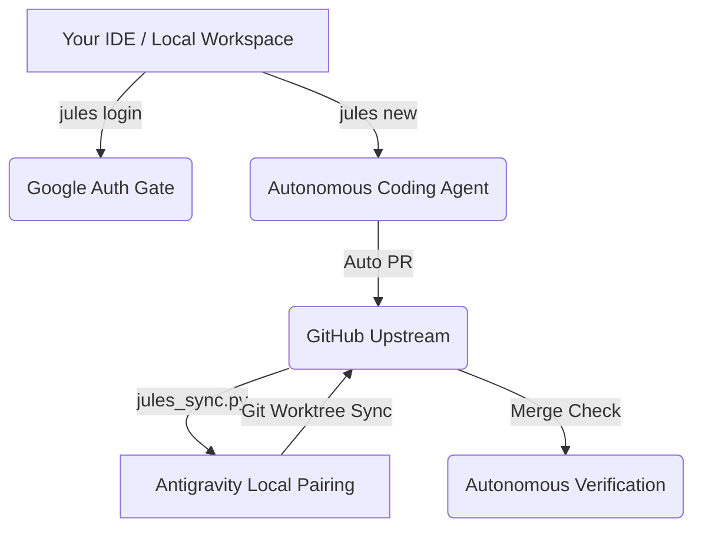

# The Complete Google Jules CLI & Co-Authoring Manual

Welcome! This manual provides a high-fidelity reference for the **Google Jules CLI (`v0.1.42`)**, our powerful upstream autonomous AI coding agent, and how to utilize all its features for code reviews, testing, security audits, and real-time pairing with Antigravity.

---

## 🚀 The Jules Ecosystem Architecture



---

## ⚡ 1. Authenticating your Session

Jules requires active authentication with your Google Account to initialize remote reasoning sessions and interact with codebases.

### Commands:
```powershell
# Authenticate your terminal session
jules login

# Log out of your current session
jules logout
```

> [!TIP]
> Running `jules login` will open your default web browser to authorize the Google account. Once authenticated, the credential token will be securely cached locally.

---

## 🎯 2. Assigning Tasks to Jules (`jules new`)

The `new` command assigns an autonomous coding task directly to Jules. It defaults to the current working directory's git repository.

### Commands:
```powershell
# Assign a standard task to current repo
jules new "write comprehensive unit tests for ClawGlove runtime worker"

# Assign a task targeting a specific GitHub repository
jules new --repo navakanth1984/kqlbridge "optimize AST parsing loops in parser.py"

# Run parallel sessions (e.g. 3 distinct agents) for the same prompt to compare variations
jules new --repo navakanth1984/kqlbridge --parallel 3 "refactor recursive iff constructs"
```

### Advanced Shell Orchestration:
You can chain multiple tasks or parse TODO items directly into the CLI:
```powershell
# Create multiple parallel sessions for each task line in TODO.md
cat TODO.md | while IFS= read -r line; do jules new "$line"; done

# Pull the hardest issue assigned to you and send it to Jules
gh issue list --assignee @me --limit 1 --json title | jq -r '.[0].title' | jules new
```

---

## 📊 3. Remote Session Management (`jules remote`)

Track, list, and retrieve the outcomes of your remote autonomous sessions.

### Commands:
```powershell
# List all active sessions
jules remote list --session

# List all tracked repositories
jules remote list --repo

# Pull the final patch/result of a session
jules remote pull --session <session_id>

# Pull and automatically apply the patch to your current branch
jules remote pull --session <session_id> --apply
```

---

## 🌀 4. Teleporting (`jules teleport`)

The `teleport` command instantly clones the repository associated with a session, checks out the active branch, and applies Jules' patches in one command.

```powershell
# Teleport into session workspace
jules teleport <session_id>
```

---

## 🤝 5. The Local Sync & Co-Authoring Loop (`jules_sync.py`)

To sync with the Jules bot Pull Request branches without incurring cloud builder fees, run our local CLI bridge:

```powershell
# Launch the local co-authoring dashboard
python scripts/jules_sync.py
```

### CLI Dashboard Options:
| Option | Action | Technical Impact |
|---|---|---|
| **`[1]`** | Sync Upstream | Fetches the latest PR updates from origin. |
| **`[2]`** | Allocate Worktree | Provisions a clean, isolated git worktree inside `kqlbridge-worktrees/` for the selected branch. |
| **`[3]`** | Run Test Suite | Launches pytest in the correct PYTHONPATH context inside the selected worktree. |
| **`[4]`** | Push Modifications | Automatically stages, commits, and pushes your pairing edits back to Jules' PR branch to trigger the downstream verification gate. |
| **`[5]`** | Exit | Safely closes the CLI bridge. |

---

## 🛠️ Testing all Features: Step-by-Step Exercise

Follow this loop to test the complete power of Jules and Antigravity:

1. **Login:** Run `jules login` to connect your Google account.
2. **Assign Task:** Run `jules new "optimize the ExecutionWorker command checks in ClawGlove"`.
3. **Verify Sessions:** Run `jules remote list --session` to monitor progress.
4. **Teleport or Pull:** Once complete, use `jules remote pull --session <id> --apply` to pull the code.
5. **Sync & Co-Author:** Run `python scripts/jules_sync.py` to sync, allocate worktrees, run local tests, and push edits upstream to GitHub!
