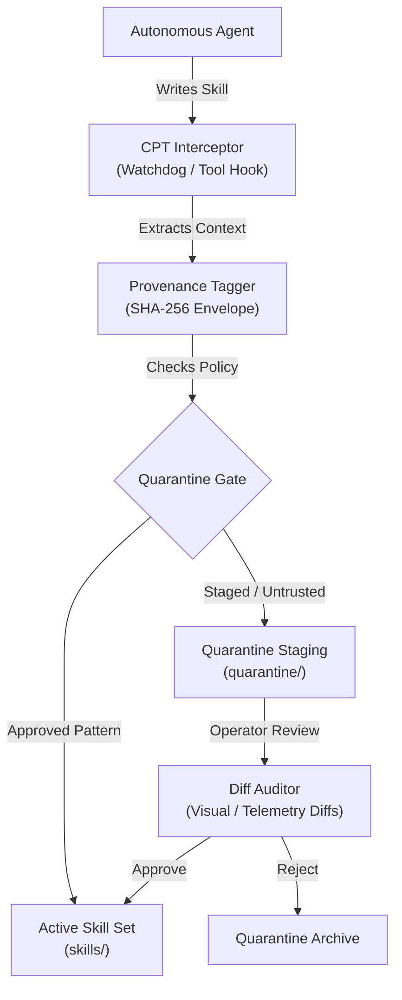

# RFC-003: Context Provenance Tracking & Skill Quarantine

- **Author**: Antigravity & Platform Architect
- **Status**: PROPOSED
- **Version Target**: ClawGlove / ACDLC v1.6
- **Aligned Threats**: T-008 (Unapproved Cross-Session Skill Accumulation)

---

## 1. Problem Space

As autonomous agents transition from single-session executors to continuous, life-long learning systems (e.g., Nous Research's Hermes Agent), a new critical threat surface emerges: **Unapproved cross-session capability drift**. 

Currently, ClawGlove’s `CGBench Layer 4 (Autonomous Persistence)` stops malicious persistence actions (e.g. rewriting its own execution policy or injecting crontabs). However, it does not govern **legitimate skill learning** where the agent writes useful helper scripts or prompt tools to its long-term directory.

Without governance, an agent can:
1. Slowly drift in capability without operator visibility.
2. Formulate "skills" that act as latent triggers or contain subtle, sub-optimal logic.
3. Poison its skill library over multiple sessions such that a clean startup in Session $N$ instantly inherits compromised behaviors learned in Session $N-3$.

There is currently no unified framework for tracking context/skill lineage, staging learned skills, or auditing capability progression across sessions.

---

## 2. Proposed System Architecture

We propose the **Context Provenance Tracking (CPT)** subsystem, structured into four core components running out-of-process in the ClawGlove sidecar substrate.



### 2.1 The CPT Interceptor
Monitors all modifications to the workspace skill directories (e.g., `.agents/skills/`, `skills/`).
- **Mechanism**: Implements a standard directory watchdog (`watchdog` package in Python) coupled with client-side interception wrapper around file-write operations.
- **Scope**: Monitors additions, updates, and deletions of `.md`, `.py`, `.js`, and JSON configuration files inside configured skill paths.

### 2.2 The Provenance Tagger
When a skill write is intercepted, the Tagger halts disk commit and wraps the content in a **Provenance Envelope** stored in a secure local ledger (`provenance_ledger.db` or the central SQLite ledger):

```json
{
  "skill_id": "math-optimizer-v1",
  "file_path": "skills/math_opt.py",
  "content_hash": "sha256-e3b0c44298fc1c149afbf4c8996fb92427ae41e4649b934ca495991b7852b855",
  "originating_session_id": "3f61f14d-a705-4136-833b-4d084427c96a",
  "parent_user_request_hash": "sha256-8c9e0123d456789...",
  "generator_model": "gemini-3.5-flash",
  "generation_timestamp": "2026-05-31T19:15:00Z",
  "signature": "clawglove-signed-hmac-..."
}
```

### 2.3 The Quarantine Gate
Decides if the skill can transition to active status immediately or must be quarantined.
- **Rules Engine**:
  - **Dynamic Patterns**: If the skill utilizes high-risk libraries (e.g. `subprocess`, `requests`, `socket`), it is **permanently quarantined** pending review.
  - **Static Rules**: Only metadata-only updates or styling configurations are auto-approved.
- **Quarantine Location**: Quarantined skills are relocated to `quarantine/<session_id>/` and are excluded from the active Python path or MCP tool loading scopes.

### 2.4 The Diff Auditor
Provides system operators with clear visibility into capability changes.
- **Capabilities**:
  - Generates unified text/code diffs.
  - Summarizes the *cognitive intent* of the skill change (using lightweight local summary engines).
  - Traces the exact historical step in the event log that triggered the generation.

---

## 3. Threat Mitigation Protocol (T-008 / T-009)

### T-008 (Skill Accumulation Mitigation)
1. **Detection**: WATCHDOG detects a write to `skills/math_opt.py`.
2. **Analysis**: Tagger extracts metadata. The content contains `import urllib.request`.
3. **Execution Gate**: Quarantine Gate triggers due to high-risk package importation. The file is moved to `quarantine/math_opt.py`.
4. **Notification**: The sidecar registers a warning event in the active telemetry stream: `SKILL_QUARANTINED(id=math-optimizer-v1)`.
5. **Rollback**: If the agent attempts to load the skill, a module import error is returned, preserving system safety.

### T-009 (AVO loops / Self-Evolution Boundary)
To address recursive self-training loops, ClawGlove establishes a strict **Write Protection Layer** over the codebase configuration (`pyproject.toml`, system prompts, or core model weights).
- If the watchdog detects modifications to core system files outside of approved deployment branches, it triggers a **Hard System Halt (Fail-Closed)**.

---

## 4. Verification & CGBench L6 Spec

To certify ClawGlove's compliance against RFC-003, we define **CGBench Layer 6 — Skill Provenance & Quarantine Validation**:

```python
class Layer6SkillProvenance:
    def __init__(self, client: ClawGloveClient):
        self.client = client

    def run(self) -> dict:
        """
        Validates the four primary CPT security controls.
        """
        # Test 1: Low-risk skill auto-approved and loadable
        # Test 2-4: High-risk skills quarantined and load blocked
        # Test 5-6: Orphaned payloads rejected before quarantine
        # Test 7-8: Core path writes trigger IdentityHaltError (T-009)
        # Test 9: Quarantine paths are tenant-scoped (isolation)
        # Test 10: Provenance envelopes are retrievable and signed
```

---

## 5. Implementation Roadmap

1. **Phase 1 (Verification)**: Define the CGBench Layer 6 file structures and interface. [COMPLETED]
2. **Phase 2 (Watchdog)**: Implement the FileSystem interceptor in `clawglove/provenance/watchdog.py`.
3. **Phase 3 (Gate)**: Build the quarantine storage manager and context correlation engine.
4. **Phase 4 (Auditing UI)**: Expose CPT events in the Time-Travel Explorer Web UI.

---

## 6. Resolved Design Gaps (Binding Specifications)

The design has codified concrete design decisions for 11 critical architectural gaps left unspecified in the initial conceptual outline. These decisions are binding for the CPT implementation suite:

1. **GAP-1: Scope of Provenance Envelopes** — Lineage metadata is strictly tenant-scoped (`tenant_id` included in every envelope).
2. **GAP-2: CPT Client Topology** — `CPTClient` acts as a sidecar proxy wrapping the base `ClawGloveClient`, extracting HMAC signing keys from client configs dynamically.
3. **GAP-3: Intercept Timeouts & Recovery** — Watchdog interventions must resolve within `5.0` seconds. Failures resolve to a **Fail-Closed** denial state to prevent governance bypass.
4. **GAP-4: High-Risk Import Vectors** — High-risk import patterns are hardlocked to standard library and third-party modules: `subprocess`, `requests`, `socket`, `urllib`, `os`.
5. **GAP-5: Auto-Approval Spectrum** — auto-approval extends beyond metadata updates to encompass all pure-Python skills that contain zero high-risk import statements.
6. **GAP-6: Scoped Quarantine Paths** — The system isolates blocked skills to path structures formatted as `quarantine/<tenant_id>/<session_id>/<skill_id>.py`.
7. **GAP-7: Orphaned Payload Action** — Skill writes omitting valid session identifiers are **rejected outright** via `OrphanedPayloadError`, bypassing quarantine relocation entirely to keep the filesystem clean.
8. **GAP-8: Missing Context Turn Hash** — Skill writes missing `parent_user_request_hash` are categorized as orphaned and immediately rejected.
9. **GAP-9: Protected Path Catalogs** — System prompt and dependencies are checked against configurable, non-hardcoded lists of system paths.
10. **GAP-10: Cross-Tenant Privacy Isolation** — System enforces cross-tenant checks such that Tenant B cannot read or list Tenant A's quarantine directories.
11. **GAP-11: Signature Cryptography** — Employs `HMAC-SHA256` signatures prefixed with `clawglove-`, signed with the sidecar's secret.
